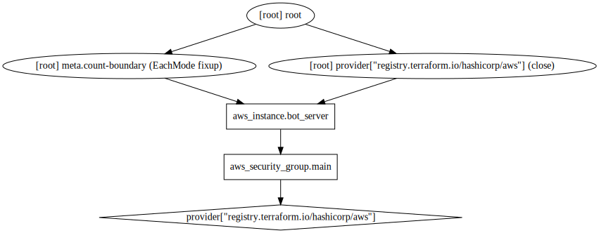

[](https://github.com/ariel17/twitter-echo-bot/actions/workflows/main.yml)
[](https://goreportcard.com/report/github.com/ariel17/twitter-echo-bot)
[](https://circleci.com/gh/ariel17/twitter-echo-bot/tree/master)

# Twitter echo bot

This is a very simple application, a proof of concept as working code written in
Golang, that access Twitter API to send an answer in the name of the account
owner for those tweets that matches the query pattern.

## Example

[See it on Twitter.](https://twitter.com/ariel_17_/status/1451647851180740609)


## Docker image

The Docker image is hosted at [Docker Hub](https://hub.docker.com/r/ariel17/twitter-echo-bot)
and it is build and pushed through [GitHub Actions](./actions).


### How to build it

```bash
$ docker build -t twitter-echo-bot .
```

### How to execute it

```bash
$ docker run -p 8080:8080 \
    -e CONSUMER_API_KEY="key" \
    -e CONSUMER_API_SECRET="secret" \
    -e ACCESS_TOKEN="token" \
    -e ACCESS_TOKEN_SECRET="token_secret" \
    -e SEARCH_QUERY="#ariel17echobot" \
    -e RESPONSE_TEXT="bip bop bip!" \
    -e JOB_SECONDS=10 \
    twitter-echo-bot
```

Using an `.env` is preferred, also the deployment process uses it to provide
the required settings to the application instead of setting raw environment
variables. **Watch out to not track it!**

```bash
$ docker run --env-file=.env twitter-echo-bot
```

### Using make commands

This project includes a Makefile to avoid writting all those commands by hand
and go directly to the point with the same results:

```bash
$ make build  # to test and build the image with :dev tag

$ make run  # builds AND executes the application in your terminal
```

## Production deployment

The deployment is made using [Terraform](https://www.terraform.io/) to a AWS
t2.nano instance. The execution plan works as follows:



:warning: This configuration uses SSH to provision the Docker service, to pull
and execute the image; it may not be the most secure option for you.

### Development lifecycle


